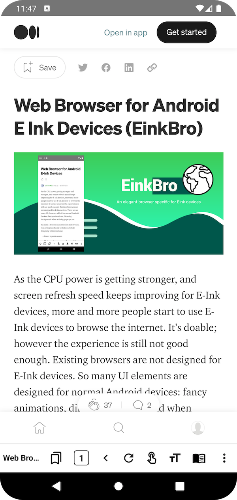
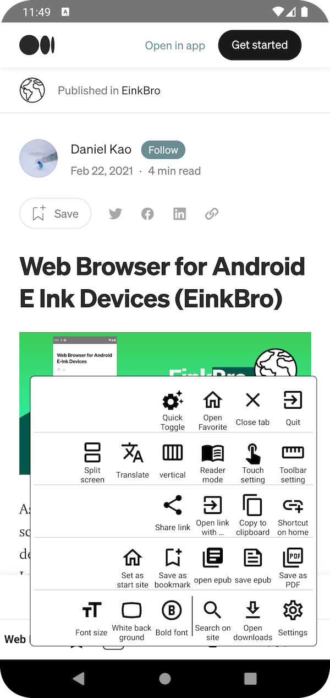
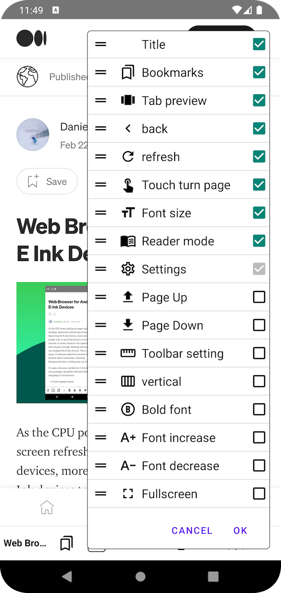
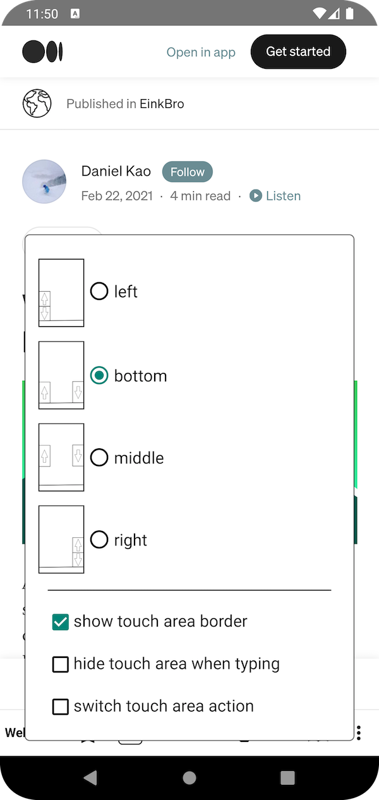
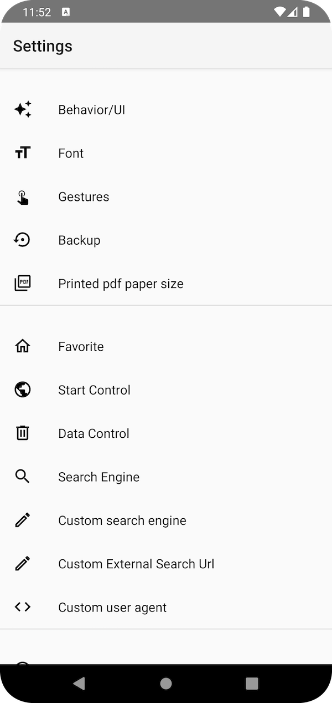

# EinkBro: Android E-ink device specific Browser 

This browser is called EinkBro. It's designed to fit Eink devices' needs; no unnecessary UI transitions, clear B&W icons, useful feature for eink reading experience. It's originated from [FOSS Browser](https://github.com/scoute-dich/browser), which is fully free/libre (as in freedom) Android app. 

     
     
      

|Main Screen|Menu Items|Toolbar Configuration|
|----|----|----|
||||
|Touch Setting|Settings|Vertical Read|
||||

### E-Ink specific features

- **tapping on screen left/right edge for pageUp/Down** (finger button on toolbar)
- **reader mode**
- **vertical reading mode** (for Chinese/Japanese content)
- **export web content to epub file** (better results when used with reader mode)
- pageUp / pageDown / Back button on toolbar
- **physical volume keys for pageUp/pageDown**
- desktop mode feature
- all icons in high contrast colors
- tab count in bottom function bar
- font size configuration in first layer setting.

#### Customizable Toolbar Icons

* web title
* web tab count
* bookmarks
* refresh
* go backward
* go forward
* bold font
* increase font size
* decrease font size
* text size configuration dialog
* touch screen area to turn page buton
* page up
* page down
* reader mode
* vertical reader mode
* fulltext translation
* setting
* toolbar configuration dialog
* rotate screen
* fullscreen

### Basic UI/Handling:

- optimized for one hand handling (toolbar at bottom)
- tab control (switch, open, close unlimited tabs)
- full material design
- fullscreen browsing (optional)
- navigation button in fullscreen mode
- fast toggle for most important settings
- advanced gesture control for toolbar and navigation button

### Some nice extra features:

- small size
- search on site
- open links in background
- Websearch (from marked text context menu)
- screenshots of the whole website
- share/save as PDF
- open links in other apps (for example YouTube)

### Development environment supported by JetBrains
   
     

App icon is made by <a href="https://www.flaticon.com/authors/turkkub" title="turkkub">turkkub</a> from <a href="https://www.flaticon.com/" title="Flaticon">www.flaticon.com</a>

