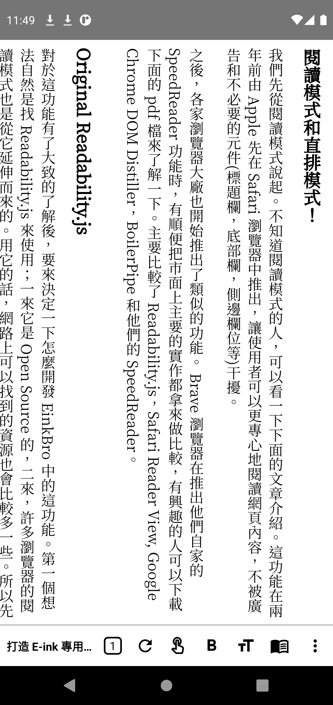

# EinkBro: Small Android Browser made for Eink devices 

EinkBro is designed to fit Eink devices' needs; no unnecessary UI transitions and animations, clear B&W icons, useful features for eink reading experience. It's originated from [FOSS Browser](https://codeberg.org/Gaukler_Faun/FOSS_Browser), which is fully free/libre (as in freedom) Android app. 

      

## EinkBro has a book about how it was developed!

## Screenshots

|Main Screen|Menu Items|Toolbar Configuration|
|----|----|----|
||||
|Touch Setting|Settings|Vertical Read|
||||

## E-Ink specific features

- **tap on screen left/right area for pageUp/Down**
- **use physical volume keys for pageUp/pageDown**
- **reader mode**
- **vertical reading mode** (for Chinese/Japanese content)
- **export web content to epub files**
- pageUp / pageDown button on toolbar
- all icons in high contrast colors
- tab count in bottom function bar
- font size configuration in first layer setting.
- custom font with local font files

## Customizable Toolbar Icons

* web title
* web tab count
* bookmarks
* refresh
* go backward
* go forward
* bold font
* increase font size
* decrease font size
* text size configuration dialog
* touch screen area to turn page buton
* page up
* page down
* reader mode
* vertical reader mode
* fulltext translation
* setting
* toolbar configuration dialog
* rotate screen
* fullscreen

## Basic UI/Handling:

- optimized for one hand handling (toolbar at bottom)
- tab control
- fullscreen browsing
- floating button in fullscreen mode
- fast toggle for most important settings
- gesture control for floating navigation button
- multi-touch gesture support

## Some nice extra features:

- small size
- search on site
- open links in background
- Websearch (from marked text context menu)
- screenshots of the whole website
- share/save as PDF
- open links in other apps (for example YouTube)

## Development environment supported by JetBrains
   
     

App icon is made by <a href="https://www.flaticon.com/authors/turkkub" title="turkkub">turkkub</a> from <a href="https://www.flaticon.com/" title="Flaticon">www.flaticon.com</a>

<a href="https://www.flaticon.com/free-icons/language" title="language icons">Language icons created by Those Icons - Flaticon</a>
<a href="https://www.flaticon.com/free-icons/split-screen" title="split screen icons">Split screen icons created by Fajrul Fitrianto - Flaticon</a>
