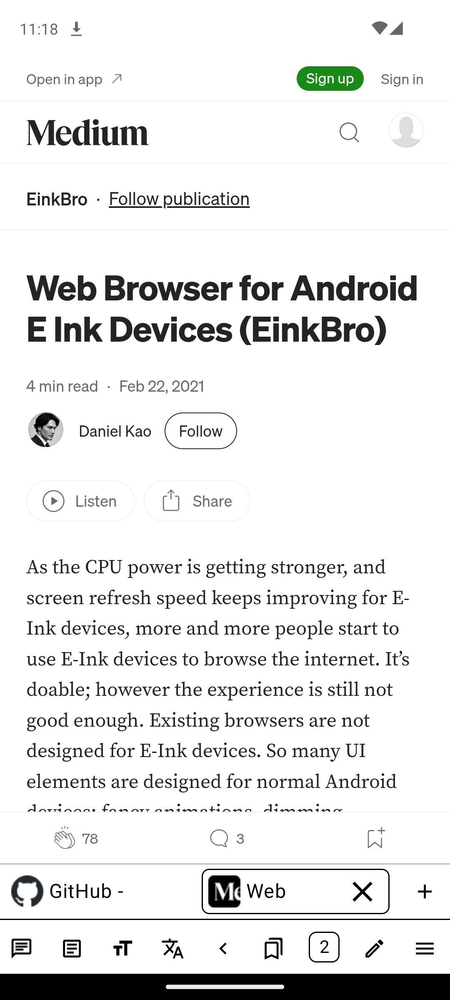
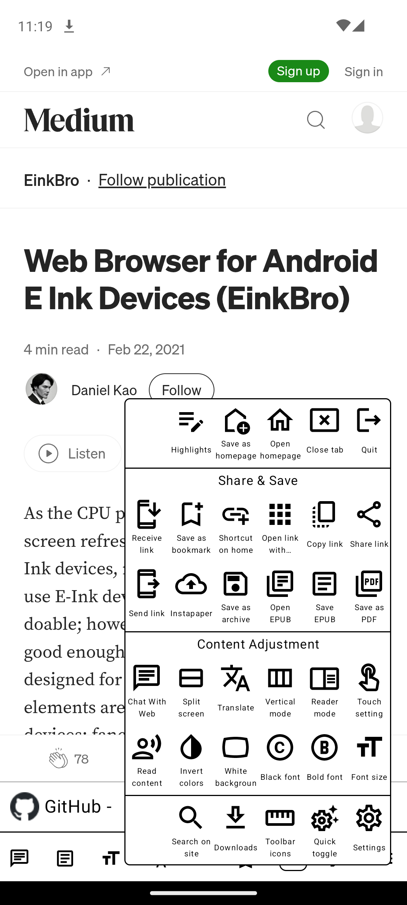
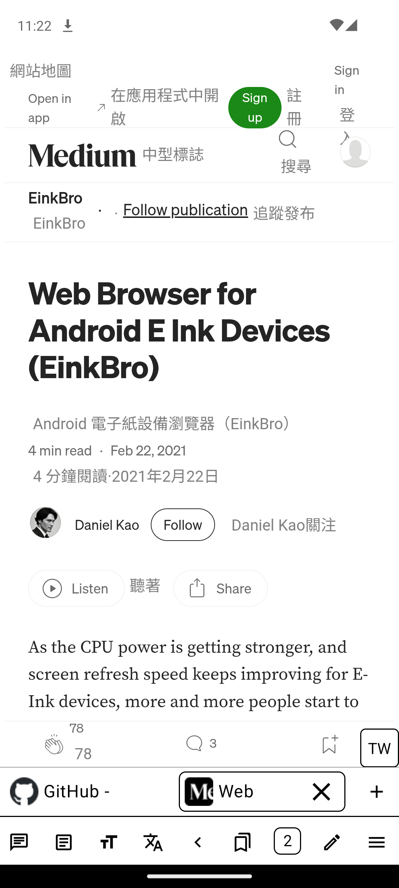
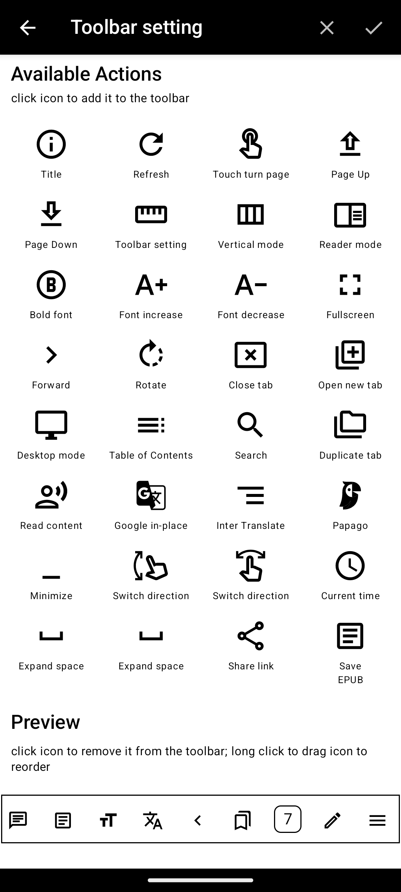
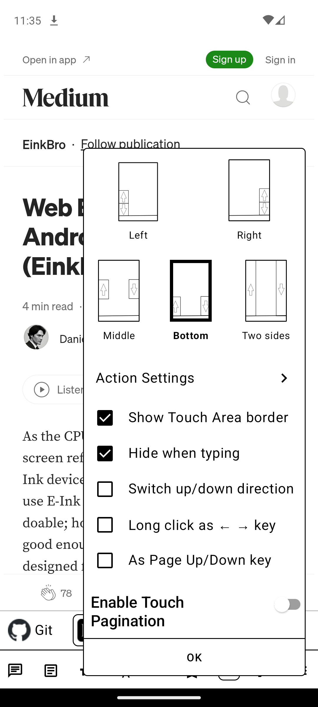
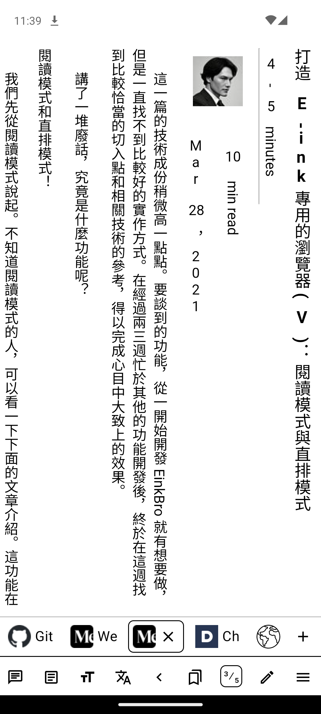
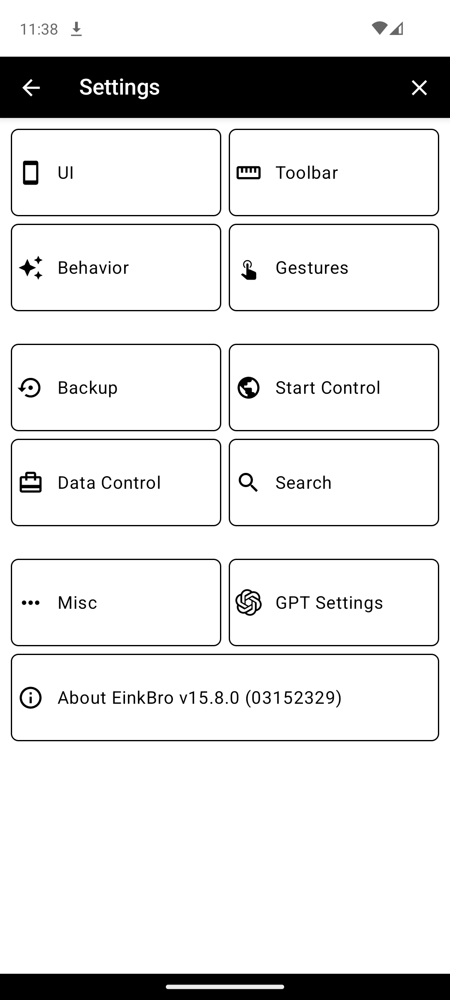
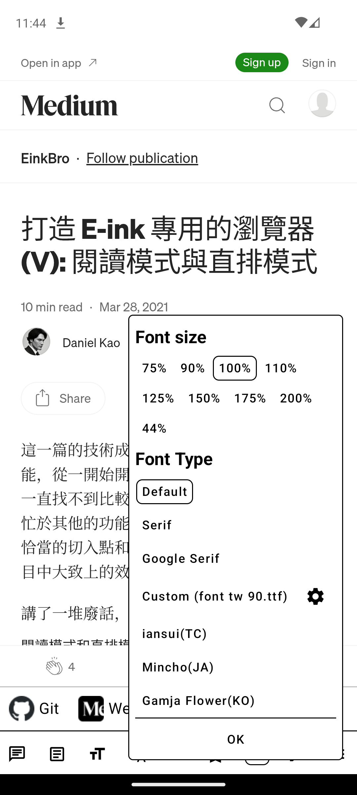
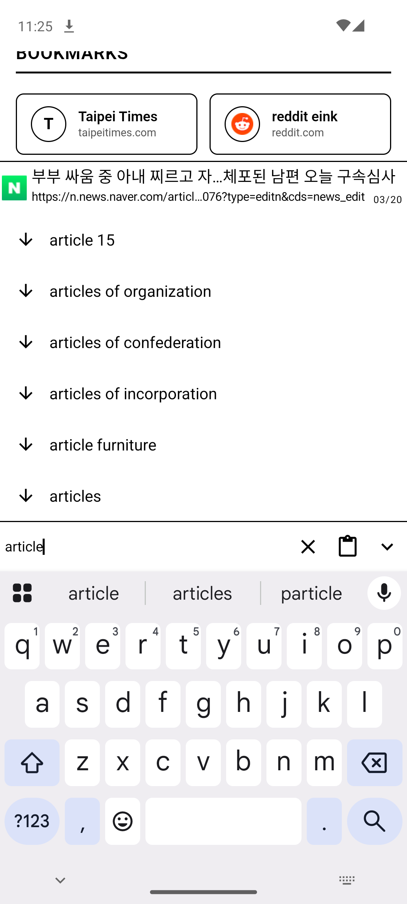
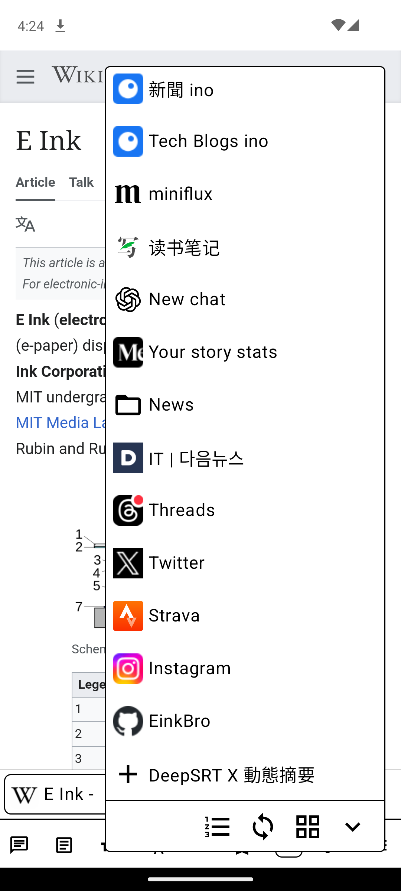

# EinkBro: Android Browser for E-Ink Devices

EinkBro is designed to fit E-Ink devices' needs; no unnecessary UI transitions and animations, clear B&W icons, useful features for an optimal e-ink reading experience. It's originated from [FOSS Browser](https://codeberg.org/Gaukler_Faun/FOSS_Browser), which is fully free/libre (as in freedom) Android app.

   

## EinkBro has a book about how it was developed!

## Screenshots

|Main Screen|Menu Items|Translation|
|----|----|----|
||||
|Toolbar Configuration|Touch Setting|Vertical Read|
||||
|Settings|Font Size|Chat with Web|
||||
|Bookmarks| | |
|| | |

---

## E-Ink Optimized Reading

EinkBro is built from the ground up for E-Ink displays, with features that make web browsing comfortable on e-readers.

- **Tap screen edges to turn pages** — configurable left/right or top/bottom touch areas for page up/down
- **Volume key navigation** — use physical volume keys to scroll pages
- **Reader mode** — strips away clutter for a clean, distraction-free reading experience
- **Vertical reading mode** — vertical text layout for Chinese/Japanese content
- **Custom fonts** — load local font files; separate font settings for reader mode
- **Bold font toggle** — improve readability on low-contrast E-Ink screens
- **High contrast UI** — all icons and controls designed for E-Ink visibility
- **No animations** — zero unnecessary transitions or dimming effects

## AI Integration

Chat with web pages, summarize content, and run custom AI actions — all within the browser.

- **Chat with Web** — ask questions about the current page content using AI (supports split-screen and new tab modes)
- **Page AI** — run whole-page AI actions with customizable prompts
- **Multiple AI providers** — OpenAI, Google Gemini, Ollama, and any OpenAI-compatible server
- **Custom GPT actions** — define reusable actions with system prompts for text selection or full page context
- **TTS (Text-to-Speech)** — read content aloud using OpenAI TTS, ReadAloud, or system TTS

## Translation

Translate web content without leaving the browser, with multiple translation methods and providers.

- **Paragraph-by-paragraph translation** — inline translated text alongside the original for easy comparison
- **Multiple providers** — Google Translate, DeepL, Papago, OpenAI, and Google Gemini
- **Full page translation** — translate the entire page via Google Translate
- **Image translation** — translate text within images with cached results
- **Dual captions** — display subtitles in two languages on YouTube videos

## Save & Export

Multiple ways to save and share web content for offline reading.

- **Export to EPUB** — save web content as EPUB files with images and table of contents
- **Save as PDF** — configurable paper sizes for PDF export
- **Save as MHT** — archive pages while preserving original layout
- **Full-page screenshots** — capture entire web pages as images
- **Instapaper integration** — save articles directly to Instapaper
- **Share & copy links** — share content to other apps or clipboard

## Customizable UI

Tailor the browser's interface to your workflow with extensive customization options.

- **Configurable toolbar** — choose from 40+ action icons; drag to reorder
- **Toolbar position** — place toolbar at top or bottom; separate configs for portrait/landscape
- **Floating navigation button** — gesture-controlled button in fullscreen mode (swipe up/down/left/right)
- **Tab management** — unlimited tabs with tab bar, preview, and background loading
- **Bookmarks** — grid or list view with folder support and drag-to-reorder
- **Split screen** — side-by-side browsing with AI chat or search results
- **Quick toggle** — fast access to frequently used settings

## Browsing & Privacy

Standard browser features with privacy controls and E-Ink-friendly optimizations.

- **Ad blocking** — built-in ad blocker with customizable filter lists and auto-update
- **Multiple search engines** — Google, DuckDuckGo, Startpage, Bing, and more with search suggestions
- **JavaScript/cookie whitelists** — fine-grained control over per-site permissions
- **Tracking parameter pruning** — automatically strips utm_* and other tracking query parameters
- **Incognito mode** — private browsing with configurable clear-on-exit options
- **Desktop mode** — toggle desktop user agent per site
- **Search on page** — find text within the current page
- **VI key bindings** — keyboard shortcuts for power users
- **Highlight text** — mark and manage text highlights on web pages

## Development environment supported by JetBrains

App icon is made by <a href="https://www.flaticon.com/authors/turkkub" title="turkkub">turkkub</a> from <a href="https://www.flaticon.com/" title="Flaticon">www.flaticon.com</a>

<a href="https://www.flaticon.com/free-icons/language" title="language icons">Language icons created by Those Icons - Flaticon</a>
<a href="https://www.flaticon.com/free-icons/split-screen" title="split screen icons">Split screen icons created by Fajrul Fitrianto - Flaticon</a>
