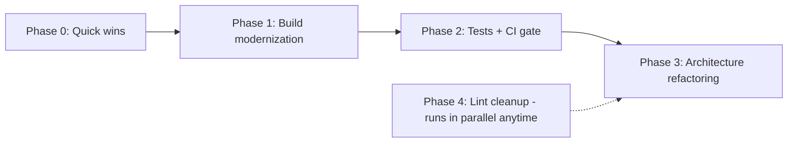

# EinkBro Health & Refactoring Roadmap

*Last updated: 2026-06-10*

This document organizes the technical-debt and modernization work needed to keep the
codebase healthy and make future feature implementation easier. Guiding principle:
**incremental and release-safe** — every item lands as a small, reviewable change that
keeps the app shippable; structural refactors are sliced one piece per release cycle,
never as a big-bang rewrite.

## Current state snapshot

What is already healthy and should be preserved:

- **Module boundaries**: `app` → `ad-filter` → `adblock-client` dependencies are clean
  (only ~9 import sites of ad-filter in app, zero direct app → adblock-client imports).
- **Async patterns**: coroutines + StateFlow throughout; no `AsyncTask`, no deprecated
  `onActivityResult`; modern Activity Result contracts.
- **UI stack**: ~90% Jetpack Compose; only one legacy XML layout remains
  (`layout-v26/dialog_edit_extension.xml`).
- **ProGuard/R8 discipline**: rules are documented with rationale
  (`app/proguard-rules.txt`); release uses `proguard-android-optimize.txt` deliberately.
- **Code hygiene**: only ~3 TODO/FIXME comments in 45k lines of Kotlin.

Pain points:

| Area | Evidence | Symptom |
|---|---|---|
| God classes | `SettingActivity.kt` 1,510 lines; `BrowserActivity.kt` 1,067 lines (17 delegates, 11 ViewModels); `EBWebView.kt` 957; `SiteSettingsDialogFragment.kt` 959; `Toolbar.kt` 927; `BackupUnit.kt` 874; `SettingComposeUi.kt` 852; `NinjaWebViewClient.kt` 773 | Hard to test, hard to modify safely; these are also the top churn files of the last 100 commits |
| DI style | ~25 classes use `KoinComponent` + `by inject()` (service locator) instead of constructor injection | Hidden dependencies, poor testability |
| Build drift | AGP 8.7.1, Gradle 8.9, Kotlin 2.0.0; ad-filter still Groovy DSL + kapt with coroutines 1.3.7, core-ktx 1.3.2, serialization-json 1.0.1; Compose UI 1.6.8 vs Material 1.7.2; `navigation-compose:2.8.0-rc01` (an RC) in production | Version skew risks subtle incompatibilities; old toolchain blocks newer libraries |
| Test gap | 6 JVM test files / 36 tests; zero instrumented tests; CI builds APKs but runs no tests and no lint | The highest-churn files (BrowserActivity, SettingActivity, NinjaWebViewClient) have no safety net |
| Lint baseline | 241 baselined issues: 78 UnusedResources, 26 RtlHardcoded, 17 GradleDependency, 16 TypographyEllipsis, 11 ContentDescription, 11 ExtraTranslation, …; `MissingTranslation` disabled despite 32 locales | Dead resources inflate the APK; locale drift goes undetected |

## Phase dependencies

Sequencing rationale:

- **Phase 0/1 first** — cheap, low-risk, and a current toolchain unblocks newer test
  libraries and Compose APIs needed later.
- **Phase 2 before Phase 3** — never restructure churn hotspots without tests and a CI
  gate in place first.
- **Phase 4 anytime** — lint/resource cleanup is independent and parallel-friendly.

## Phase 0 — Quick wins (hours; zero behavior change)

- [x] Remove the duplicate `implementation(project(":ad-filter"))` in
      `app/build.gradle.kts` (declared twice).
- [x] Drop the unused `mediation-test-suite` entry from `gradle/libs.versions.toml`.
- [x] Replace `navigation-compose:2.8.0-rc01` with the stable release and align
      `navigation-runtime-ktx` (currently 2.7.7) to the same version.
- [x] Pin `ndkVersion` in `adblock-client/build.gradle` so NDK updates cannot silently
      change the native build (pinned to 27.0.12077973, the AGP 8.7 default).
- [x] Remove the stale `buildToolsVersion "29.0.3"` lines in `ad-filter` and
      `adblock-client` (AGP supplies a current default).

## Phase 1 — Build & dependency modernization (independent items, 1–2 sessions each)

- [ ] **Align Compose versions**: UI artifacts 1.6.8 → 1.7.x to match Material 1.7.2 —
      or better, adopt the Compose BOM so the set can never skew again.
- [ ] **Refresh aged androidx deps in app**: `fragment-ktx` 1.3.6 → 1.8.x; unify
      `androidx.work` (app 2.7.0 vs ad-filter 2.4.0) on one current version.
- [ ] **Koin 3.1.2 → 3.5.x** — prerequisite for the Phase 3 DI cleanup.
- [ ] **ad-filter module modernization**: convert `build.gradle` Groovy → Kotlin DSL;
      refresh coroutines 1.3.7 → 1.8.x, core-ktx 1.3.2 → current,
      kotlinx-serialization-json 1.0.1 → 1.6.x. Migrate kapt → ksp *if* the Mezzanine
      compiler supports KSP; if not, keep kapt and record it here as accepted debt.
- [ ] **Version catalog consolidation**: move the dozens of inline versions in
      `app/build.gradle.kts` into `gradle/libs.versions.toml`; migrate the root
      `buildscript {}` classpath block to the `plugins {}` DSL with catalog references.
- [ ] **Toolchain upgrade**: Gradle 8.9 → latest stable 8.x, AGP 8.7.1 → latest stable
      8.x, then Kotlin 2.0.0 → 2.1.x with the matching KSP and Compose-compiler plugin.
      AGP 9 and targetSdk 35/36 are tracked as "when forced or ready" follow-ups, not
      part of this phase.

## Phase 2 — Test safety net + CI gate (before any structural refactoring)

- [ ] **CI gate**: add `./gradlew test lintDebug` to
      `.github/workflows/buid-app-workflow.yaml` (debug variant — fast, no signing
      needed) so every PR runs unit tests and lint.
- [ ] **Unit tests for already-pure logic** (no refactoring needed first):
  - config/preference classes (`ConfigManager` and the `*Config` objects built on the
    already-tested preference delegates)
  - DAOs and `RecordRepository` via in-memory Room
  - `EpubParser` / `MarkdownParser` / `EpubCoverParser`
  - `OpenAiRepository` via OkHttp `MockWebServer`
  - `BackupUnit` JSON export/import round-trips
- [ ] **Locale completeness check**: a Gradle task (or CI script) that verifies every
      key in `values/strings.xml` exists in all 32 locale files and flags extras —
      replaces the currently disabled `MissingTranslation` lint check with something
      actionable.
- [ ] *(Optional)* ktlint or detekt with a baseline, so style/safety rules apply to new
      code without demanding a one-time whole-repo cleanup.

## Phase 3 — Architecture refactoring (one slice per release cycle)

Ordered by value vs. risk. Each slice follows the same loop:
**extract → unit-test the extracted class → run the `regression` skill on the emulator → release.**

1. [ ] **Settings split** (lowest risk, high payoff): break `SettingActivity.kt` (1,510)
       and `SettingComposeUi.kt` (852) into one file per settings screen, with the pure
       setting-item data lists separated from the composables so each screen is
       previewable and testable in isolation.
2. [ ] **BrowserActivity decomposition**: continue the proven delegate-extraction
       pattern (`ChromeSetupDelegate`, `ExternalSearchDelegate` are the precedent).
       Target: a thin activity that only wires delegates to ViewModels; `dispatch()`
       branches migrate into the existing handler classes (`ToolbarActionHandler`,
       `MenuActionHandler`, `KeyHandler`).
3. [ ] **NinjaWebViewClient (773)**: extract content post-processing, SSL/error
       handling, and ad-filter request interception into focused collaborators so the
       `WebViewClient` is routing only.
4. [ ] **EBWebView (957)**: keep extracting helpers — `WebViewReaderHelper`,
       `WebViewTranslationHelper`, `WebViewNavigationHelper` already set the pattern —
       until the class is wiring plus WebView overrides only.
5. [ ] **ConfigManager**: separate per-domain configuration (currently split between an
       in-memory map and BookmarkManager persistence) from global preferences.
6. [ ] **DI cleanup, opportunistic**: every newly extracted class takes constructor
       parameters; retire `by inject()` from the `*Unit` singletons
       (`BrowserUnit`, `ViewUnit`, `HelperUnit`, `BackupUnit`) as they get touched.
       No big-bang Koin rewrite.

## Phase 4 — Lint & resource burn-down (ongoing, parallel-friendly)

Burn down `app/lint-baseline.xml` by category, regenerating the baseline after each pass:

- [ ] **UnusedResources (78)** first — direct APK size win with resource shrinking.
- [ ] **RtlHardcoded (26)** — switch left/right to start/end for RTL locales (ar, he).
- [ ] **ContentDescription (11)** — accessibility.
- [ ] **TypographyEllipsis (16)** and **ExtraTranslation (11)** — mechanical fixes.
- [ ] Re-enable the `MissingTranslation` check (or rely on the Phase 2 locale task) once
      locale completeness is enforced.
- [ ] Goal: an empty `lint-baseline.xml`.

## Out of scope / explicitly rejected

- **R8 full mode** (`android.enableR8.fullMode=true`) — evaluated and rejected.
- **Dropping `proguard-android-optimize.txt`** — costs ~1MB APK growth on a ~7MB
  release (documented in `app/build.gradle.kts`).
- **Big-bang rewrites** of BrowserActivity or the DI layer — slices only.
- **Remote crash reporting** (Crashlytics/Sentry) — the privacy posture is local crash
  logging only (`CustomExceptionHandler` → `Downloads/crash_log.txt`).
