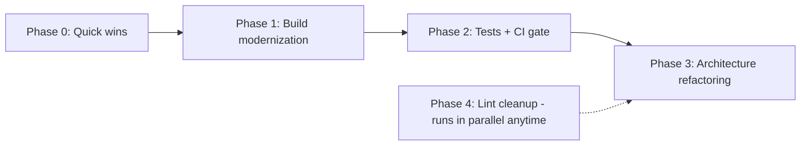

# EinkBro Health & Refactoring Roadmap

*Last updated: 2026-06-10*

This document organizes the technical-debt and modernization work needed to keep the
codebase healthy and make future feature implementation easier. Guiding principle:
**incremental and release-safe** — every item lands as a small, reviewable change that
keeps the app shippable; structural refactors are sliced one piece per release cycle,
never as a big-bang rewrite.

## Current state snapshot

What is already healthy and should be preserved:

- **Module boundaries**: `app` → `ad-filter` → `adblock-client` dependencies are clean
  (only ~9 import sites of ad-filter in app, zero direct app → adblock-client imports).
- **Async patterns**: coroutines + StateFlow throughout; no `AsyncTask`, no deprecated
  `onActivityResult`; modern Activity Result contracts.
- **UI stack**: ~90% Jetpack Compose; only one legacy XML layout remains
  (`layout-v26/dialog_edit_extension.xml`).
- **ProGuard/R8 discipline**: rules are documented with rationale
  (`app/proguard-rules.txt`); release uses `proguard-android-optimize.txt` deliberately.
- **Code hygiene**: only ~3 TODO/FIXME comments in 45k lines of Kotlin.

Pain points:

| Area | Evidence | Symptom |
|---|---|---|
| God classes | `SettingActivity.kt` 1,510 lines; `BrowserActivity.kt` 1,067 lines (17 delegates, 11 ViewModels); `EBWebView.kt` 957; `SiteSettingsDialogFragment.kt` 959; `Toolbar.kt` 927; `BackupUnit.kt` 874; `SettingComposeUi.kt` 852; `NinjaWebViewClient.kt` 773 | Hard to test, hard to modify safely; these are also the top churn files of the last 100 commits |
| DI style | ~25 classes use `KoinComponent` + `by inject()` (service locator) instead of constructor injection | Hidden dependencies, poor testability |
| Build drift | AGP 8.7.1, Gradle 8.9, Kotlin 2.0.0; ad-filter still Groovy DSL + kapt with coroutines 1.3.7, core-ktx 1.3.2, serialization-json 1.0.1; Compose UI 1.6.8 vs Material 1.7.2; `navigation-compose:2.8.0-rc01` (an RC) in production | Version skew risks subtle incompatibilities; old toolchain blocks newer libraries |
| Test gap | 6 JVM test files / 36 tests; zero instrumented tests; CI builds APKs but runs no tests and no lint | The highest-churn files (BrowserActivity, SettingActivity, NinjaWebViewClient) have no safety net |
| Lint baseline | 241 baselined issues: 78 UnusedResources, 26 RtlHardcoded, 17 GradleDependency, 16 TypographyEllipsis, 11 ContentDescription, 11 ExtraTranslation, …; `MissingTranslation` disabled despite 32 locales | Dead resources inflate the APK; locale drift goes undetected |

## Phase dependencies

Sequencing rationale:

- **Phase 0/1 first** — cheap, low-risk, and a current toolchain unblocks newer test
  libraries and Compose APIs needed later.
- **Phase 2 before Phase 3** — never restructure churn hotspots without tests and a CI
  gate in place first.
- **Phase 4 anytime** — lint/resource cleanup is independent and parallel-friendly.

## Phase 0 — Quick wins (hours; zero behavior change)

- [x] Remove the duplicate `implementation(project(":ad-filter"))` in
      `app/build.gradle.kts` (declared twice).
- [x] Drop the unused `mediation-test-suite` entry from `gradle/libs.versions.toml`.
- [x] Replace `navigation-compose:2.8.0-rc01` with the stable release and align
      `navigation-runtime-ktx` (currently 2.7.7) to the same version.
- [x] Pin `ndkVersion` in `adblock-client/build.gradle` so NDK updates cannot silently
      change the native build (pinned to 27.0.12077973, the AGP 8.7 default).
- [x] Remove the stale `buildToolsVersion "29.0.3"` lines in `ad-filter` and
      `adblock-client` (AGP supplies a current default).

## Phase 1 — Build & dependency modernization (independent items, 1–2 sessions each)

- [x] **Align Compose versions**: all Compose artifacts on a single catalog version
      (1.7.8); one `compose` version ref means the set can no longer skew.
- [x] **Refresh aged androidx deps in app**: `fragment-ktx` 1.3.6 → 1.8.9; unified
      `androidx.work` on 2.10.5 (was app 2.7.0 vs ad-filter 2.4.0).
- [x] **Koin 3.1.2 → 3.5.6** — prerequisite for the Phase 3 DI cleanup.
- [x] **ad-filter module modernization**: converted to Kotlin DSL; coroutines
      1.3.7 → 1.10.2, core-ktx 1.3.2 → 1.16.0, kotlinx-serialization-json
      1.0.1 → 1.6.3. **Accepted debt:** kapt stays — Mezzanine ships no KSP
      processor (upstream repo has only `mezzanine-compiler`, kapt-based).
- [x] **Version catalog consolidation**: all dependency and plugin versions live in
      `gradle/libs.versions.toml`; root `buildscript {}` replaced with `plugins {}`
      aliases; `settings.gradle.kts` now owns repositories via `pluginManagement` /
      `dependencyResolutionManagement`.
- [x] **Toolchain upgrade**: Gradle 8.9 → 8.14.5, AGP 8.7.1 → 8.13.2, Kotlin
      2.0.0 → 2.1.20 with KSP 2.1.20-1.0.32 (KSP1 deliberately — Room 2.6.1 does not
      support KSP2; revisit with a Room 2.7.x migration). compileSdk 34 → 36
      (targetSdk stays 34). AGP 9 and targetSdk 35/36 remain "when forced or ready"
      follow-ups.

## Phase 2 — Test safety net + CI gate (before any structural refactoring)

- [x] **CI gate**: the workflow now has a `test` job running
      `testDebugUnitTest lintDebug` plus the locale check on every push/PR; reports
      upload on failure. Lint baseline regenerated for the AGP 8.13 lint engine after
      fixing all newly surfaced errors (incl. a real Kotlin-2.x `removeLast()`
      API-35 crash and API-26 `java.nio` usage in the EPUB parsers).
- [x] **Unit tests for already-pure logic** — 193 tests now (was 36):
  - all `*Config` preference classes incl. legacy-migration paths (in-memory
    `SharedPreferences` fake); serializable data classes locked to their wire format
  - `EpubParser` / `EpubCoverParser` / `EpubXMLFileParser` with in-memory zip
    fixtures; `MarkdownParser`
  - `OpenAiRepository` via MockWebServer (completions, tools, SSE streaming, error
    kinds), injected through the self-hosted URL config
  - `BackupUnit` JSON round-trips and zip-manifest parsing
  - **Deferred:** DAO/Room tests need Robolectric (new test infra — own decision);
    Gemini/TTS network paths have hardcoded URLs (needs a small testability refactor,
    fold into Phase 3); BackupUnit zip restore is instrumentation territory.
- [x] **Locale completeness check**: `scripts/check_locale_strings.py` — fails CI on
      stale keys (locale keys missing from the default), reports lagging translations
      per locale. Two stale `changelog_dialog` entries removed.
- [ ] *(Optional)* ktlint or detekt with a baseline, so style/safety rules apply to new
      code without demanding a one-time whole-repo cleanup.

## Phase 3 — Architecture refactoring (one slice per release cycle)

Ordered by value vs. risk. Each slice follows the same loop:
**extract → unit-test the extracted class → run the `regression` skill on the emulator → release.**

1. [x] **Settings split** (lowest risk, high payoff): all thirteen setting-item lists
       now live in `setting/screens/` (one file per screen) built from a small
       `SettingScreenDeps` holder; backup launchers stay in the activity behind a
       `BackupOps` interface. `SettingActivity.kt` 1,510 → 515 lines, pure code
       motion, verified by walking every settings route on the emulator.
       `SettingComposeUi.kt` (852) was left as-is — it is shared rendering
       infrastructure (SettingScreen/item composables), not per-screen content.
2. [~] **BrowserActivity decomposition** — re-scoped after inspection: the earlier
       delegate-extraction wave already did this. The remaining ~1,070 lines are
       mostly the ~80-method `BrowserController` interface surface implemented as
       one-line forwards, plus `dispatch()` (a clean single action router — moving
       its branches into the three handlers would duplicate routing, not improve it).
       Further shrinking requires segregating the `BrowserController` interface — a
       deep refactor, parked as future work below, not a slice.
3. [x] **NinjaWebViewClient**: e-ink image interception (`EinkImageInterceptor`),
       SSL/client-cert/HTTP-auth handling (`WebViewSslHandler`), and error-page
       rendering (`WebErrorPagePresenter`) extracted as constructor-injected
       collaborators; the `WebViewClient` overrides are one-line forwards.
       773 → 558 lines, pure code motion, verified on the emulator (page load,
       error page, retry flow).
4. [x] **EBWebView**: `WebViewTouchSimulator` (click/long-click simulation, link
       interaction) and `WebViewConfigApplier` (web settings, preferences, UA, dark
       mode, cookies) extracted following the existing helper pattern. 957 → 770
       lines. `dispatchTouchEvent`/scroll handling stays — core input path. Verified
       on emulator (page load, selection menu, invert colors).
5. [x] **ConfigManager**: per-domain configuration extracted to
       `DomainConfigManager` (constructor-injected global configs + a persist
       lambda; no Koin). ConfigManager keeps forwards, no call sites changed.
       352 → 286 lines. Verified via the site-settings dialog round trip.
6. [ ] **DI cleanup, opportunistic**: every newly extracted class takes constructor
       parameters; retire `by inject()` from the `*Unit` singletons
       (`BrowserUnit`, `ViewUnit`, `HelperUnit`, `BackupUnit`) as they get touched.
       No big-bang Koin rewrite.

## Phase 4 — Lint & resource burn-down (ongoing, parallel-friendly)

Burn down `app/lint-baseline.xml` by category, regenerating the baseline after each pass:

- [ ] **UnusedResources (78)** first — direct APK size win with resource shrinking.
- [ ] **RtlHardcoded (26)** — switch left/right to start/end for RTL locales (ar, he).
- [ ] **ContentDescription (11)** — accessibility.
- [ ] **TypographyEllipsis (16)** and **ExtraTranslation (11)** — mechanical fixes.
- [ ] Re-enable the `MissingTranslation` check (or rely on the Phase 2 locale task) once
      locale completeness is enforced.
- [ ] Goal: an empty `lint-baseline.xml`.

## Out of scope / explicitly rejected

- **R8 full mode** (`android.enableR8.fullMode=true`) — evaluated and rejected.
- **Dropping `proguard-android-optimize.txt`** — costs ~1MB APK growth on a ~7MB
  release (documented in `app/build.gradle.kts`).
- **Big-bang rewrites** of BrowserActivity or the DI layer — slices only.
- **Remote crash reporting** (Crashlytics/Sentry) — the privacy posture is local crash
  logging only (`CustomExceptionHandler` → `Downloads/crash_log.txt`).
